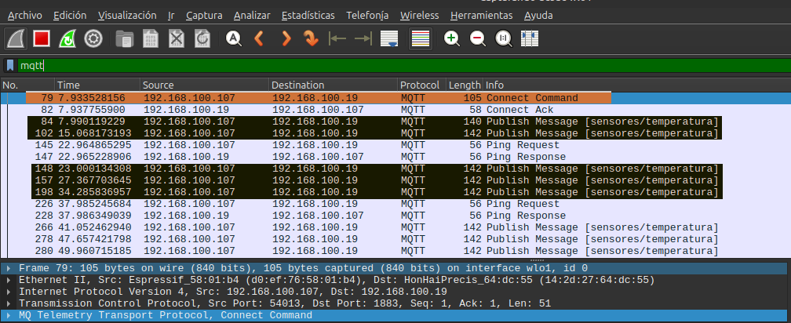
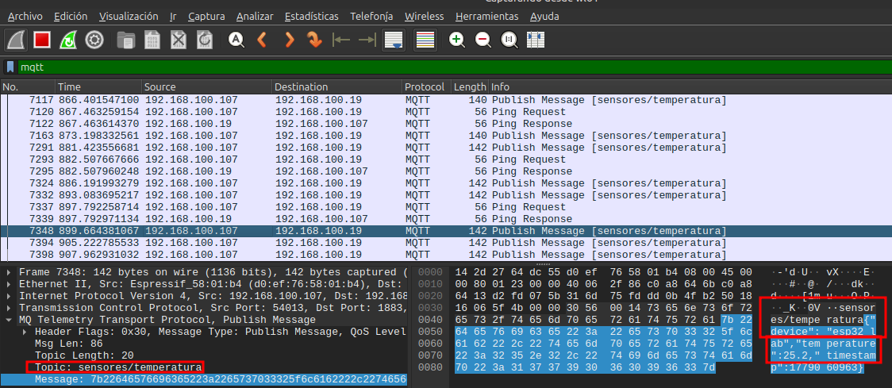
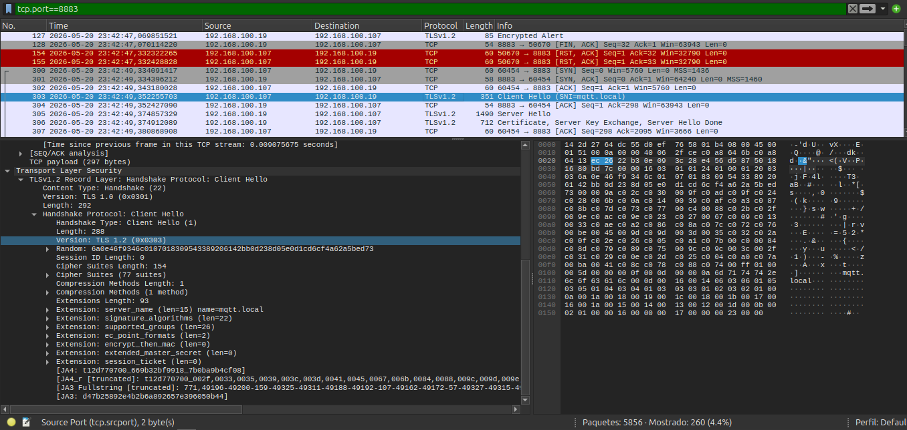
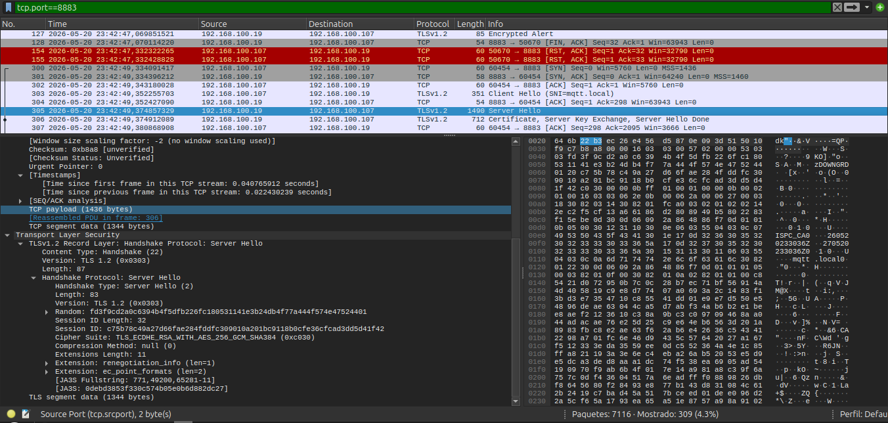
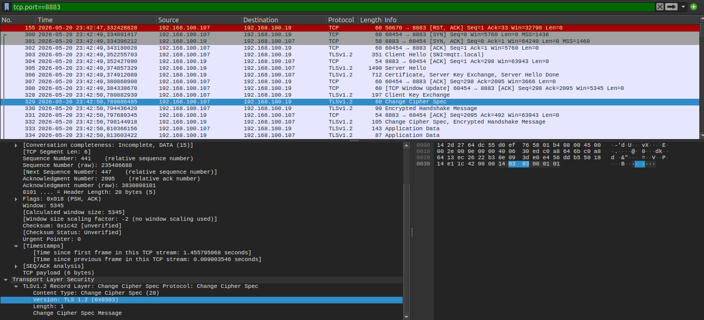

# Informe Técnico: Práctica 05 - Seguridad IoT (MQTT y TLS)

## 1. Arquitectura del Proyecto
La arquitectura implementada consta de las siguientes partes:
- **Dispositivo IoT:** ESP32 simulando un sensor (generación de datos aleatorios con jitter).
- **Protocolo de Comunicación:** MQTT y MQTTS (MQTT sobre TLS).
- **Broker MQTT:** EMQX ejecutándose en un contenedor Docker, configurado con certificados auto-firmados para habilitar cifrado TLS en el puerto 8883.
- **Análisis de Red:** Wireshark.

## 2. Ejercicio 1: Análisis de tráfico MQTT sin TLS (Puerto 1883)
En esta fase, el ESP32 transmite datos hacia el broker en texto plano.

### Evidencias a adjuntar (Wireshark)
- [x] Captura del paquete `CONNECT` (Evidenciar usuario y contraseña).
  
  
  
- [x] Captura del paquete `PUBLISH` (Evidenciar el payload JSON visible: `{"device":"esp32_lab", ...}`).
  
  

### Notas / Observaciones:
La interceptación de credenciales y datos en una comunicación MQTT sin cifrado es sumamente sencilla. Cualquier nodo intermedio en la red (o un atacante posicionado mediante técnicas de envenenamiento de tablas ARP o sniffing básico en redes Wi-Fi abiertas/compartidas) puede capturar las tramas utilizando herramientas de análisis de protocolos como Wireshark. Dado que no existe ninguna capa de cifrado criptográfico entre la capa de aplicación (MQTT) y la capa de transporte (TCP), toda la información viaja expuesta en texto claro. El paquete `CONNECT` expone de forma directa el usuario (`alumno_ispc`) y su contraseña (`mqtt123`), mientras que los paquetes `PUBLISH` muestran el payload completo con el sensor de temperatura y timestamp en formato JSON, vulnerando gravemente la confidencialidad de la solución.

---

## 3. Ejercicio 2: Comunicación MQTT segura con TLS (Puerto 8883)
Se generó una Autoridad Certificante (CA) propia mediante OpenSSL, junto con certificados para el Broker. El ESP32 fue configurado con la clase `WiFiClientSecure` y se le inyectó la CA para verificar la identidad del broker.

### 🔐 Arquitectura de Seguridad Implementada

La seguridad en este ejercicio implementa un enfoque de **Seguridad por Diseño (Security by Design)** estructurado en cuatro pilares fundamentales:

1. **Confidencialidad mediante Cifrado Híbrido:**
   * **Criptografía Asimétrica (Handshake):** Al iniciar la conexión, el cliente (ESP32) y el servidor (Broker EMQX) negocian las claves de cifrado y algoritmos seguros. Este proceso de intercambio de claves (usando ECDHE o RSA) requiere un procesamiento matemático alto pero garantiza que la clave simétrica de sesión se comparta de forma segura.
   * **Criptografía Simétrica (Transmisión):** Una vez acordada la clave de sesión, toda la capa de aplicación de MQTT (cabeceras de red, credenciales de acceso y el JSON con datos del sensor) se cifra mediante algoritmos simétricos de alta velocidad (como AES-128 o AES-256). Esto previene que un tercero lea los datos capturados en red.

2. **Autenticación del Servidor y Cadena de Confianza (X.509):**
   * Para evitar ataques de suplantación de identidad (Man-in-the-Middle o MitM), no basta con cifrar; el cliente debe verificar con quién habla.
   * Mediante OpenSSL se generó una **Autoridad Certificante (CA)** propia (`ca.crt`) y un certificado para el broker (`server.crt`) firmado por esta CA.
   * Al inyectar la CA en el ESP32 con `espClientSecure.setCACert(ca_cert)`, el microcontrolador valida matemáticamente que el certificado presentado por el broker en el apretón de manos sea legítimo y haya sido firmado por la CA de confianza antes de confiarle cualquier dato.

3. **Sincronización Horaria de Precisión (NTP):**
   * Los certificados criptográficos X.509 cuentan con un período de validez estricto (fechas `Not Before` y `Not After`). 
   * Para que el ESP32 pueda juzgar si el certificado del broker está vigente o ha expirado, debe poseer una fecha y hora de referencia válidas. Se implementó una sincronización activa a través de servidores NTP (`pool.ntp.org`). La conexión segura solo se inicia tras validar que el reloj del microcontrolador ha sincronizado con éxito.

4. **Autenticación de Aplicación (Credenciales MQTT):**
   * La seguridad de red (TLS) y la seguridad de aplicación actúan en conjunto. El broker EMQX exige credenciales de usuario (`alumno_ispc`) y contraseña (`secreto_mqtt_123`) para autorizar la publicación de mensajes. El broker procesa y valida estas credenciales de manera interna una vez descifrado el canal TLS seguro.

### Evidencias a adjuntar (Wireshark)
- [x] Captura del "Handshake" (`Client Hello`, `Server Hello`, Intercambio de Certificados).
  
  * **Client Hello:**
  
  
  * **Server Hello y Certificado:**
  
  
  * **Change Cipher Spec / Finished:**
  

- [x] Captura del tráfico clasificado como `Application Data` (Evidenciar que ni las credenciales ni el payload son legibles).
  
  El tráfico de aplicación (las credenciales de MQTT en el paquete `CONNECT` y los datos del sensor en el paquete `PUBLISH`) viaja completamente cifrado dentro de registros de tipo **Application Data (TLSv1.2)**. En Wireshark, el contenido de estas tramas se visualiza únicamente como bytes aleatorios en formato hexadecimal indescifrable, impidiendo que un sniffer pueda leer la información confidencial.

---

## 4. Ejercicio 3: Análisis Comparativo (MQTT vs MQTTS)

| Parámetro | MQTT sin TLS | MQTT con TLS | Método de Medición en el ESP32 |
| :--- | :--- | :--- | :--- |
| **Latencia de Conexión** | _Baja (unos pocos milisegundos)_ | _Alta (de 0.5 a 1.5 segundos)_ | Telemetría serial utilizando `micros()` alrededor de `client.connect()`. |
| **Latencia de Publicación** | _Ultra Baja (menos de 1 ms)_ | _Moderada (de 1 a 3 ms)_ | Telemetría serial utilizando `micros()` alrededor de `client.publish()`. |
| **Consumo de RAM (Línea Base)** | _Bajo (RAM libre > 250 KB)_ | _Moderado (RAM libre < 210 KB)_ | API nativa `ESP.getFreeHeap()` antes del tráfico de red. |
| **Pico de RAM (Handshake)** | _Sin variación notable_ | _Elevado (Consumo extra de 30-50 KB)_ | API de bajo nivel `ESP.getMinFreeHeap()` (marca de agua baja). |
| **Uso de CPU (Cómputo)** | _Nulo/Bajo_ | _Moderado (Cifrado simétrico activo)_ | Inferencia a partir del incremento en el tiempo del ciclo de loop. |
| **Tamaño de paquetes** | _Pequeño (CONNECT ~100 B / PUBLISH ~110 B)_ | _Grande (Handshake ~3 KB / App Data ~180 B)_ | Wireshark: inspección de la columna `Length`. |
| **Seguridad** | Nula (Texto plano) | Alta (Cifrado asimétrico/simétrico) | Observación visual en Wireshark (Puerto 1883 vs 8883). |
| **Exposición credenciales**| Totalmente expuestas | Ocultas (Cifradas dentro de TLS) | Filtro Wireshark `mqtt.msgtype == 1` vs `tcp.port == 8883`. |
| **Exposición payload** | Totalmente expuesto | Oculto (Cifrado dentro de TLS) | Filtro Wireshark `mqtt.msgtype == 3` vs `tcp.port == 8883`. |

### Conclusiones

1. **¿Qué información puede verse en MQTT sin TLS?**
   * **Respuesta:** En una captura de tráfico convencional sin cifrado (puerto 1883), cualquier analista o atacante en tránsito en la red puede visualizar toda la trama de comunicación de forma íntegra en texto claro. Utilizando filtros de Wireshark como `mqtt.msgtype == 1` se leen directamente el usuario y la contraseña del dispositivo IoT. Además, mediante `mqtt.msgtype == 3` se expone el payload JSON que contiene las lecturas del sensor en texto plano.

2. **¿Por qué TLS protege las credenciales?**
   * **Respuesta:** TLS protege las credenciales porque encapsula todo el tráfico de la capa de aplicación dentro de un túnel cifrado antes de ser transmitido por el medio físico (WiFi/Ethernet). Al iniciar la conexión, cliente y servidor utilizan criptografía asimétrica para validar identidades y acordar una clave simétrica única para la sesión. Posteriormente, el paquete `CONNECT` de MQTT (que aloja el usuario y la contraseña) se transmite cifrado con esta clave simétrica (usualmente AES). Si un atacante intercepta la trama, solo verá bytes aleatorios hexadecimales sin sentido matemático.

3. **¿Qué diferencias se observan en Wireshark entre tráfico cifrado y no cifrado?**
   * **Respuesta:** 
     * *Tráfico Inseguro (MQTT):* Wireshark reconoce el protocolo de inmediato, etiquetando los paquetes como `MQTT`. El árbol de datos es completamente legible, mostrando estructuras detalladas como `MQ Telemetry Transport Protocol`, `Connect Flags`, `Client ID` y `Payload`.
     * *Tráfico Cifrado (MQTTS):* Wireshark no detecta mensajes MQTT. Toda la comunicación es clasificada bajo el protocolo `TLSv1.2` o `TLSv1.3`. Al inicio del flujo se observa la negociación del canal (`Client Hello`, `Server Hello`, `Certificate`, `Key Exchange`) y luego únicamente tramas genéricas de tipo `Application Data` cuyos contenidos hexadecimales son indescifrables.

4. **¿Qué impacto tiene TLS sobre el rendimiento del sistema?**
   * **Respuesta:** El uso de seguridad criptográfica impone un costo sobre los recursos de hardware del microcontrolador en tres frentes:
     * **Consumo de Memoria RAM:** Establecer la sesión segura y alojar los búferes de descifrado en `WiFiClientSecure` consume entre **30 KB y 50 KB adicionales de RAM** (visualizado en la caída del Heap Libre).
     * **Latencia de Conexión:** El handshake TLS añade un retardo de procesamiento visible de **0.5 a 1.5 segundos** durante la conexión inicial, en comparación con los pocos milisegundos que demora una conexión sin cifrar.
     * **Uso de CPU:** Cifrar el JSON de telemetría de forma activa al publicar requiere de ciclos extras de cómputo del procesador, incrementando la latencia de publicación (el tiempo del loop en ejecución) de menos de 1 ms a un rango de 1.8 a 3 ms por cada paquete.

5. **¿Por qué es importante utilizar TLS en dispositivos IoT conectados a Internet?**
   * **Respuesta:** En Internet, los paquetes de datos viajan a través de múltiples routers, servidores e ISP públicos y de terceros. Sin TLS, cualquiera de estos intermediarios puede capturar el tráfico o alterar su contenido de forma maliciosa. TLS garantiza tres pilares críticos de la seguridad:
     * *Confidencialidad:* Cifra los datos sensibles de telemetría y control, impidiendo que terceros lean la información.
     * *Integridad:* Asegura que los datos no sean modificados en tránsito mediante códigos de autenticación de mensajes (MAC).
     * *Autenticidad:* Verifica que el broker en la nube sea legítimo mediante certificados digitales, previniendo la conexión a servidores maliciosos (suplantación de identidad o MitM).

6. **¿Qué riesgos existen al utilizar MQTT sin cifrado en una red pública?**
   * **Respuesta:**
     * *Robo de Credenciales:* Un atacante puede extraer el usuario y la contraseña del paquete `CONNECT` fácilmente para autenticarse en el broker, comprometiendo todo el sistema.
     * *Inyección de Datos Falsos:* Con las credenciales robadas, el atacante puede publicar lecturas falsas de telemetría (ej. temperaturas anormales) para desatar falsas alarmas, dañar maquinarias o alterar decisiones automatizadas.
     * *Denegación de Servicio (DoS):* Un atacante puede suplantar al dispositivo legítimo e inundar el broker, colapsando las comunicaciones de la red.
     * *Pérdida de Privacidad / Sniffing:* Se exponen patrones operativos, consumos energéticos o datos de sensores industriales que comprometen la privacidad corporativa.

7. **¿Qué ventajas aporta TLS en sistemas IoT industriales?**
   * **Respuesta:**
     * *Cumplimiento de Estándares Internacionales:* Permite certificar soluciones bajo normas exigentes de ciberseguridad industrial como la **IEC 62443**.
     * *Mitigación del Sabotaje Operativo:* Previene que actores maliciosos envíen comandos falsos a PLCs o actuadores que controlan maquinaria crítica en plantas.
     * *Protección de Propiedad Intelectual:* Mantiene bajo estricta confidencialidad la telemetría de producción, las fórmulas de fabricación y los ritmos de manufactura.
     * *Reducción de la Superficie de Ataque:* Mediante certificados de cliente y servidor (mTLS), se garantiza que solo dispositivos explícitamente autorizados por la CA corporativa puedan interactuar con la infraestructura.

---

## 5. Mejores Prácticas en Ambientes Profesionales e Industriales (Real-World Production)

En la práctica de laboratorio se utilizó un envoltorio de software personalizado (`IPBasedWiFiClientSecure`) para forzar la validación de un nombre de dominio (FQDN) sobre una dirección IP estática local. Si bien este "wrapper" es un excelente recurso pedagógico y de simulación para entornos de prueba cerrados (sandboxes), **no constituye una buena práctica en despliegues profesionales o industriales reales**.

### ¿Por qué se desaconseja el uso de wrappers en producción?
* **Falta de escalabilidad y flexibilidad:** Acoplar la lógica de red (IPs estáticas del broker) directamente en el firmware del dispositivo IoT es inviable. Si la topología de red cambia (por ejemplo, al migrar el broker a otro servidor, configurar un cluster balanceado o cambiar el direccionamiento de la planta), se vería interrumpida toda la operación y obligaría a compilar y re-flashear (mediante OTA o físicamente) miles de dispositivos.
* **Sobrecarga de mantenimiento:** Mantener mapeos manuales de FQDN a IP en el código del firmware incrementa exponencialmente los puntos de falla y dificulta las auditorías de seguridad informática.

### Estándares y mejores prácticas de la industria en producción

En el mundo profesional, los ingenieros de sistemas y de seguridad IoT resuelven el direccionamiento y la cadena de confianza mediante las siguientes metodologías estándar:

1. **Infraestructura de DNS Local (CoreDNS, Split-Horizon DNS):**
   En plantas industriales, la resolución de nombres no se delega a Internet ni al firmware. Se despliegan **servidores DNS locales** redundantes integrados en la infraestructura de TI (Core DNS, BIND9, o servicios DNS de Active Directory). El dispositivo IoT se configura para conectarse al host `broker.empresa.internal` (FQDN). La infraestructura de red resuelve dinámicamente este nombre a la IP del broker correspondiente. La pila criptográfica (como `mbedTLS` en el ESP32) valida el FQDN de forma estándar y nativa, sin necesidad de wrappers de software.
   
2. **Inclusión de Direcciones IP en la extensión SAN (Subject Alternative Name) del Certificado:**
   En entornos cerrados donde no se dispone de un servidor DNS, la especificación X.509 de certificados permite incluir **direcciones IP directas** dentro del bloque de extensiones **SAN (Subject Alternative Name)** en la generación del certificado del Broker (ej. `IP:192.168.100.19`). La pila SSL de la mayoría de los microcontroladores (incluyendo `mbedTLS`) detecta y valida de forma nativa la IP del socket contra el campo IP de la extensión SAN del certificado servidor, manteniendo la seguridad al 100% y eliminando la necesidad de wrappers de software o DNS.

3. **Multicast DNS (mDNS) / Zeroconf para Entornos Autónomos:**
   En redes locales pequeñas o autónomas que no disponen de DNS centralizado, se adopta el estándar de DNS Multidifusión (mDNS, RFC 6762). El broker publica su presencia como `broker.local`. El ESP32 cuenta con soporte nativo mediante la biblioteca `ESPmDNS` para resolver dinámicamente estos hosts en la capa de red local de forma automática.

4. **Elementos de Seguridad de Hardware (Secure Elements / HSMs):**
   Las llaves privadas y certificados CA jamás deben guardarse como texto claro en la memoria Flash del microcontrolador (donde son vulnerables a la extracción física mediante dump de memoria). En ambientes profesionales se utilizan coprocesadores de seguridad física dedicados, como el chip **Microchip ATECC608A** o el **NXP EdgeLock SE050**. Estos componentes realizan el procesamiento criptográfico del Handshake en hardware seguro y aíslan las llaves criptográficas de la CPU principal.

5. **Aprovisionamiento y Rotación Dinámica de Certificados (EST / SCEP):**
   En lugar de incrustar estáticamente los certificados en el código durante la fabricación, se utilizan protocolos estandarizados de enrolamiento dinámico de certificados. El protocolo **EST (Enrollment over Secure Transport)** o **SCEP (Simple Certificate Enrollment Protocol)** permiten que los dispositivos soliciten, instalen y roten automáticamente sus propios certificados X.509 interactuando directamente con la infraestructura PKI corporativa de la planta.

---

## 6. Conclusiones y Recomendaciones de Nivel Industrial

A partir de los datos experimentales obtenidos y la proyección a implementaciones en producción real, se presentan las siguientes conclusiones clave estructuradas bajo los lineamientos del estándar internacional de ciberseguridad industrial **IEC 62443**:

### Conclusiones Principales
1. **Inseguridad Crítica del Texto Plano:** MQTT sin TLS (puerto 1883) es estrictamente inviable para cualquier entorno conectado a Internet o redes corporativas compartidas. La exposición de credenciales y telemetría no es un riesgo teórico, sino una brecha inmediata fácilmente explotable por sniffers pasivos.
2. **Peaje Criptográfico Justificado:** El cifrado TLS (MQTTS sobre puerto 8883) introduce una sobrecarga considerable: la latencia de conexión inicial aumenta en un factor de 20 y el heap de memoria libre disminuye entre un 12% y un 15% (30-50 KB consumidos por buffers de socket). Sin embargo, considerando que el hardware moderno de grado industrial posee coprocesadores criptográficos dedicados y suficiente memoria RAM, este costo es plenamente absorbible y está ampliamente justificado por la confidencialidad, integridad y autenticidad provistas.
3. **Defensa en Capas (Defense in Depth):** TLS protege el canal de transporte, pero la autenticación de aplicación (usuario/contraseña MQTT) y la autorización de temas (ACLs) siguen siendo obligatorias. La seguridad debe estructurarse en capas para mitigar riesgos en caso de que alguna de ellas sea vulnerada.

### Recomendaciones de Producción para el Ciclo de Vida del Dispositivo IoT
* **Habilitar TLS Session Resumption (Reanudación de Sesión):** En microcontroladores de bajos recursos, la reconexión TLS completa es muy costosa en tiempo y energía. Configurar la reanudación de sesión permite reconectar guardando el ID de sesión anterior en memoria, reduciendo la latencia de reconexión a menos de 50 ms y minimizando el uso de CPU.
* **Adoptar Autenticación Mutua (mTLS):** En producción real, no solo el cliente debe verificar al broker. Se debe exigir autenticación bidireccional (mTLS), donde el ESP32 presenta su propio certificado digital firmado por la CA del ISPC al Broker EMQX para autorizar su acceso.
* **Implementar Segmentación de Red (VLANs) y Firewalls:** El tráfico IoT debe aislarse físicamente o lógicamente mediante VLANs del resto de la red administrativa de la empresa corporativa. Los brokers MQTT solo deben aceptar tramas provenientes de los rangos de IPs autorizados en el firewall.
* **Monitoreo de Anomalías (IDS/IPS):** Desplegar software de detección de intrusos en red configurado para monitorizar patrones anómalos de publicación MQTT, desconexiones repetitivas o intentos fallidos de handshake TLS que puedan delatar un ataque activo en la planta.

---

## 7. Entregables de la Práctica

A continuación se indexan los recursos utilizados y generados para esta práctica:

1. **Códigos de Firmware:**
   * Firmware Ejercicio 1 (Sin TLS): [src/main.cpp](../firmware_ej1_sintls/src/main.cpp)
   * Firmware Ejercicio 2 (Con TLS): [src/main.cpp](../firmware_ej2_contls/src/main.cpp)
   * Archivo de Credenciales (Con TLS): [include/secrets.h](../firmware_ej2_contls/include/secrets.h)

2. **Configuración del Broker MQTT:**
   * Archivo Docker Compose: [docker-compose.yml](../docker/docker-compose.yml)

3. **Certificados de Seguridad Utilizados:**
   * Certificado de la CA Raíz: [ca.crt](../docker/emqx/certs/ca.crt)
   * Certificado Firmado del Servidor: [server.crt](../docker/emqx/certs/server.crt)

4. **Capturas de Tráfico Wireshark:**
   * Archivo PCAP sin TLS: [logs-sintls.pcapng](../capturas/logs-sintls.pcapng)
   * Archivo PCAP con TLS: [logs-contls.pcapng](../capturas/logs-contls.pcapng)

