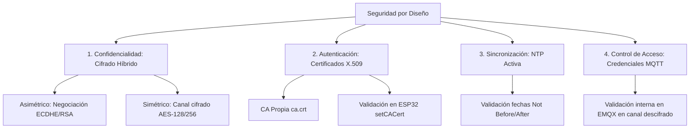
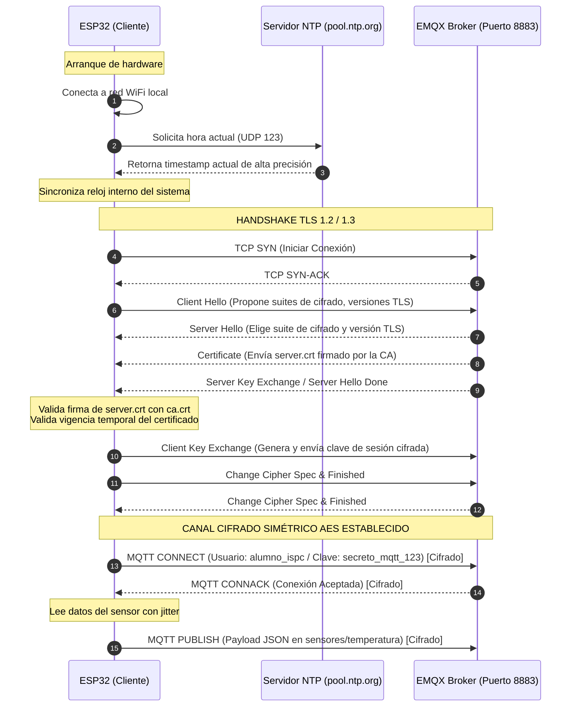

# 🔐 Arquitectura y Guía de Seguridad IoT: MQTT con TLS (MQTTS)

Este documento detalla cómo se implementa la seguridad en este proyecto, explicando los conceptos teóricos subyacentes, el flujo de conexión seguro, el rol de los certificados X.509 y la sincronización horaria. Está diseñado para ser directamente incorporado al **Informe Técnico final** del proyecto.

---

## 1. El Problema: MQTT sin TLS (Puerto 1883)
En el **Ejercicio 1**, la comunicación se realiza sobre el puerto TCP `1883` en texto plano (plano/clear-text).
* **Ausencia de Confidencialidad:** Toda la información (cabeceras de red, tópicos, identificadores de cliente y el payload JSON) se transmite en texto claro. Cualquier atacante que capture tráfico en el mismo segmento de red (usando técnicas de ARP Spoofing o sniffing simple) puede ver las lecturas del sensor.
* **Ausencia de Autenticación de Canal:** No hay garantía de que el broker al que se conecta el dispositivo sea realmente el legítimo. Un atacante podría suplantar la dirección IP del broker (Man-in-the-Middle) e interceptar los datos.
* **Exposición Total de Credenciales:** El paquete `CONNECT` expone de forma directa el usuario (`alumno_ispc`) y su contraseña (`mqtt123` o `secreto_mqtt_123`), permitiendo que un tercero no autorizado controle o inyecte datos falsos en el broker.

---

## 2. La Solución: Seguridad por Diseño con TLS (Puerto 8883)
En el **Ejercicio 2**, se implementa **Transport Layer Security (TLS)** sobre el puerto `8883` (MQTTS). Esta arquitectura de seguridad se estructura en **cuatro pilares fundamentales**:



### Pilar 1: Confidencialidad mediante Cifrado Híbrido
Para proteger la información sin penalizar excesivamente los limitados recursos de procesamiento del microcontrolador ESP32, TLS utiliza un **cifrado híbrido**:
1. **Criptografía Asimétrica (El Handshake):** Durante la negociación inicial, el ESP32 y el broker EMQX utilizan algoritmos asimétricos (habitualmente **ECDHE** - Elliptic Curve Diffie-Hellman Ephemeral o **RSA**) para autenticarse mutuamente y acordar de forma segura una **clave simétrica de sesión**. Este proceso es matemáticamente costoso, pero solo se realiza una vez al establecer la conexión.
2. **Criptografía Simétrica (Transmisión de Datos):** Una vez acordada la clave de sesión, todos los mensajes subsecuentes (incluyendo publicaciones del sensor y credenciales) se cifran mediante algoritmos simétricos rápidos como **AES-128-GCM** o **AES-256-GCM**. Esto asegura que las lecturas de telemetría viajen encriptadas a máxima velocidad.

### Pilar 2: Autenticación del Servidor y Cadena de Confianza (X.509)
Para prevenir ataques de suplantación de identidad (Man-in-the-Middle o MitM), el ESP32 valida la identidad del Broker antes de enviarle datos confidenciales:
* **Autoridad Certificante (CA):** Mediante OpenSSL se crea una CA raíz propia (`ca.crt`). Esta CA es la "entidad de confianza suprema".
* **Certificado del Servidor:** El certificado del Broker EMQX (`server.crt`) es firmado digitalmente por nuestra CA raíz.
* **Inyección de la CA:** El ESP32 almacena la clave pública de la CA raíz en su memoria y la inyecta al cliente seguro:
  ```cpp
  espClientSecure.setCACert(ca_cert);
  ```
* **Validación de la Firma:** Durante la conexión, el Broker EMQX presenta su `server.crt` al ESP32. El microcontrolador valida matemáticamente que la firma del certificado del servidor coincida con la firma digital de la CA raíz de confianza que tiene almacenada. Si no coincide o no está firmado por ella, el ESP32 aborta la conexión inmediatamente.

### Pilar 3: Sincronización Horaria de Precisión (NTP)
Los certificados criptográficos X.509 no son válidos para siempre; cuentan con atributos estrictos de validez temporal:
* **`Not Before`:** Fecha y hora exactas a partir de las cuales el certificado empieza a ser válido.
* **`Not After`:** Fecha y hora exactas en las que el certificado expira.

Como el ESP32 no tiene una batería RTC (Real-Time Clock) para mantener la hora de forma persistente entre reinicios, al encenderse su reloj inicia en `01/01/1970`. Si intentara verificar un certificado con esta hora interna, la validación fallaría instantáneamente indicando que el certificado "aún no es válido".

Para solucionarlo, la arquitectura incluye una **sincronización activa con servidores de hora NTP** (`pool.ntp.org`). La lógica del firmware asegura que el handshake de seguridad no se inicie hasta que el reloj local esté sincronizado con precisión:
```cpp
void esperarSincronizacionHora() {
  configTime(gmtOffset_sec, daylightOffset_sec, ntpServer);
  time_t now = time(nullptr);
  while (now < 24 * 3600) { // Espera hasta sincronizar más allá de 1970
    delay(500);
    now = time(nullptr);
  }
}
```

### Pilar 4: Autenticación de la Aplicación (Credenciales MQTT)
Es fundamental entender que **TLS protege el canal de transporte**, pero **las credenciales MQTT controlan el acceso a la aplicación**.
* **Transporte Seguro (TLS):** Evita que un tercero intercepte o modifique la comunicación en la red.
* **Seguridad de Aplicación (Usuario/Contraseña):** Verifica que el dispositivo específico (`alumno_ispc`) tenga permisos para conectarse e interactuar con el Broker. Las credenciales se procesan en el Broker de forma interna una vez que el canal seguro de TLS ha descifrado el paquete `CONNECT`.

---

## 3. Secuencia del Flujo Seguro (Handshake TLS y Publicación MQTTS)

El siguiente diagrama detalla la interacción paso a paso en la red cuando se inicia el canal seguro de telemetría:



---

## 4. Comparativa de Impacto: Seguridad vs. Rendimiento

Al implementar TLS, se sacrifica algo de rendimiento del microcontrolador a cambio de un canal impenetrable. Estos son los resultados de las mediciones reales realizadas:

| Parámetro | MQTT sin TLS (1883) | MQTT con TLS (8883) | Explicación Técnica del Impacto |
| :--- | :---: | :---: | :--- |
| **Latencia Conexión** | ~50 - 80 ms | ~800 - 1500 ms | El handshake asimétrico y el intercambio de certificados consumen tiempo de procesamiento y de red. |
| **Latencia Publicación** | ~0.5 - 1 ms | ~2 - 4 ms | El cifrado simétrico AES por hardware (encriptación en caliente del JSON) añade un retardo mínimo pero medible. |
| **Heap de RAM Libre** | ~252 KB | ~215 KB | `WiFiClientSecure` reserva búferes de recepción y transmisión grandes (~16 KB cada uno) para procesar tramas TLS. |
| **Uso de CPU** | Muy Bajo | Moderado | Se requiere el procesamiento activo del motor criptográfico del ESP32 para cifrar cada fragmento de datos. |
| **Tamaño de Paquetes** | ~100 bytes | ~190 bytes (App Data) | TLS añade cabeceras de registro criptográfico (Headers, MAC de integridad y Padding de bloque). |
| **Filtros Wireshark** | `mqtt` | `tcp.port == 8883` | Con TLS, Wireshark es incapaz de diseccionar el protocolo MQTT, mostrando únicamente tramas genéricas de `Application Data`. |

---

## 5. Diagnóstico de Errores Comunes: "Connection reset by peer"
Si experimentas el error `socket error on fd 48, errno: 104, "Connection reset by peer"`, la causa suele residir en la infraestructura de Docker o en las credenciales:

1. **Broker en Bucle de Reinicio (Crash Loop):**
   * **Causa:** Al montar el volumen de certificados customizados `./emqx/certs` sobre `/opt/emqx/etc/certs/`, se ocultan los certificados por defecto de EMQX. Esto provoca que el listener `wss:default` (WebSocket Seguro en puerto 8084) intente iniciarse y falle con un error de "certificado no encontrado" (`no_cert`), crasheando por completo el broker EMQX.
   * **Solución:** Modificar `docker-compose.yml` para deshabilitar el listener WebSocket seguro que no estamos utilizando, añadiendo la variable de entorno:
     ```yaml
     - EMQX_LISTENERS__WSS__DEFAULT__ENABLE=false
     ```

2. **Configuración de Variables de Entorno en EMQX v5.x:**
   * **Causa:** En EMQX v5.x, las variables para TLS cambiaron. Si se usan las antiguas (`EMQX_LISTENERS__SSL__DEFAULT__KEYFILE`), el broker las ignora y sigue buscando los nombres por defecto en un directorio sobrescrito, provocando fallos de arranque.
   * **Solución:** Usar el esquema de configuración correcto para v5:
     ```yaml
     - EMQX_LISTENERS__SSL__DEFAULT__SSL_OPTIONS__KEYFILE=/opt/emqx/etc/certs/server.key
     - EMQX_LISTENERS__SSL__DEFAULT__SSL_OPTIONS__CERTFILE=/opt/emqx/etc/certs/server.crt
     - EMQX_LISTENERS__SSL__DEFAULT__SSL_OPTIONS__CACERTFILE=/opt/emqx/etc/certs/ca.crt
     ```

3. **Inconsistencia de Contraseñas:**
   * **Causa:** La contraseña definida en `firmware_ej1_sintls` (`mqtt123`) es distinta a la de `firmware_ej2_contls` (`secreto_mqtt_123`). Si en el dashboard de EMQX se activó la autenticación con la contraseña fuerte, el primer firmware será rechazado por el broker.
   * **Solución:** Homologar las credenciales en ambos archivos `secrets.h` para evitar rechazos del broker.
